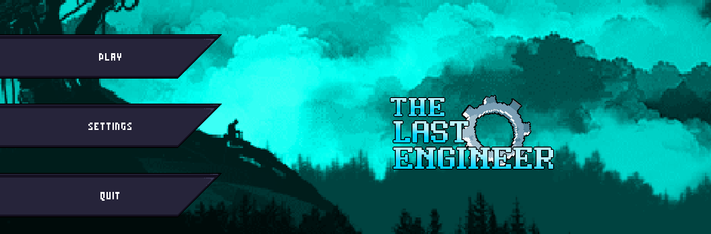
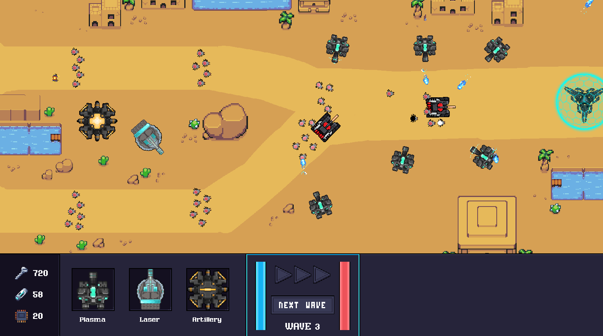
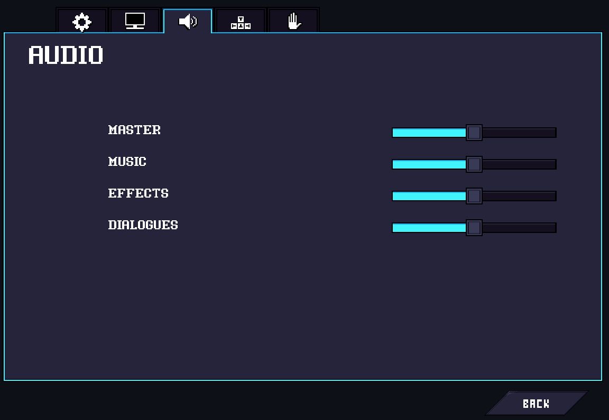
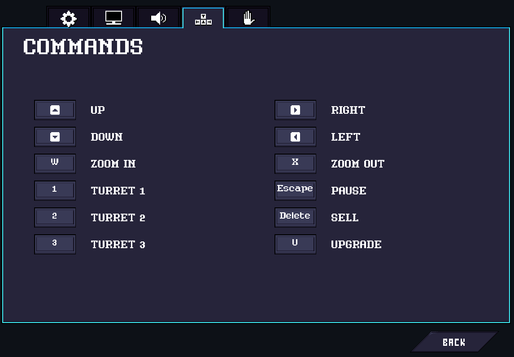
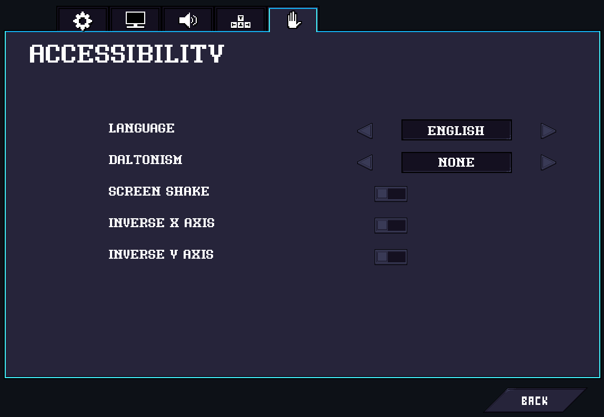

# The Last Engineer

I had the opportunity to work on a big project in C language for 3 months with my team during my studies in engineering school.

The Last Engineer is a tower defense game where you're a lost engineering on a planet, and you need to defend yourself from enemies by building turrets and placing them strategically.

## How to run the game ?

Prerequisites : **libSDL2**, **libSDL2-ttf**, **libSDL2-mixer**, **libSDL2-image**, **libJSON-c**

You can download them on Gnu/Linux with `sudo apt-get install libsdl2-dev libsdl2-ttf-dev libsdl2-mixer-dev libsdl2-image-dev libjson-c-dev`.

After downloading libraries, go to `Build` directory and type `bash run.sh`

Enjoy !
